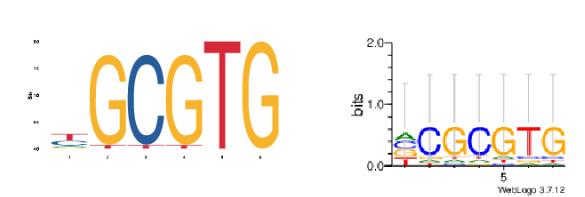
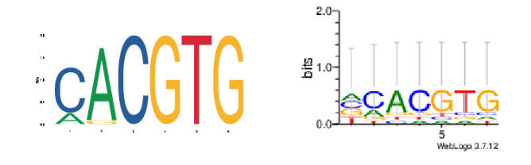
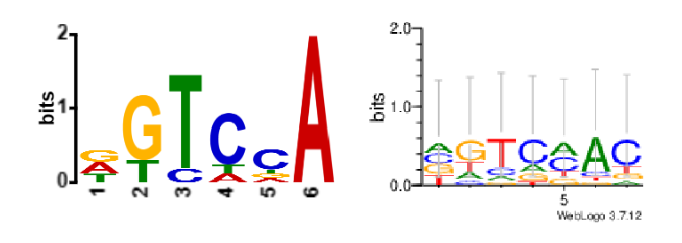

## Discover motif among DNA sequences using Expectation Maximization(EM) algorithm 
### Background 
__MEME__ is a widely used motif discovering tool, and its basic method is __Expectation Maximization(EM)__ algorithm.  
This project is to __re-implement basic EM algorithm using my own python code__ to discover motif among DNA sequence and __generate motif logos__.
Three samples will be used to test this python program.
The samples are fasta files, and every file includes couple of DNA sequences with same length. These samples are collected from JASPER database and lecture slide, and they all have reference motif logos.  
Finally, we will __compare the program-generated motif logo with reference motif logo__.

### Version
```
0.0.1
```
### Create environment and install package
Create a conda environment called `binp29`
```
conda create --name binp29 python=3.9
```
Package used in this project
```
conda   22.9.0
weblogo 3.7
python  3.9
pandas  1.4
numpy   1.21
```
Install `weblogo` in conda environment
```
conda install -c conda-forge weblogo
```
### Usage
Create a directory called `find_motif`, enter into this directory and clone this repository inside this directory.
```
mkdir find_motif
cd find_motif
git clone https://github.com/luhuim/find_motif.git
```
### Runing the program
create position weight matrix
```
python src/main.py data/Dataset3.fasta results/dataset_3.txt -kmer 6
python src/main.py data/Dataset6.fasta results/dataset_6.txt -kmer 6 
python src/main.py data/Dataset7.fasta results/dataset_7.txt -kmer 6 
```
create motif logo using `weblogo`
```
weblogo -D table -F 'png' -A 'dna' -a 'ATCG' -s large -c classic <results/dataset_3.txt> results/logo_3.png || exit
weblogo -D table -F 'png' -A 'dna' -a 'ATCG' -s large -c classic <results/dataset_6.txt> results/logo_6.png || exit
weblogo -D table -F 'png' -A 'dna' -a 'ATCG' -s large -c classic <results/dataset_7.txt> results/logo_7.png || exit
```
### Result
The motif logos generated by this program are __roughly similar to__ reference motif logos.  
The largest letters in both side of motif logo roughly match, that means the computation of this basic EM algorithm program works in right way.     
Here is the comparation between reference motif logo and this program-generated motif logos.   
(The left side is reference motif logos, and the right side is logo generated in this project)  
  
  
  

